# 

[TOC]


# 第1章 需求分析

## 1.1项目背景

​		当前云计算、“互联网+”等技术的发展速度越来越快，海量数据呈爆炸式增长，网络化办公已然成为趋势。不断出现“互联网+”政务服务、移动政务、大数据决策。其数据管理、读写功能等功能为办公带来极大的便利。“移动互联网+办公管理”的模式为提升团队合作工作的效率提供了有力的支持。

## 1.2项目意义

​		项目主要是通过强化信息化平台的应用，提供多样化、系统化的功能，针对不同的员工提供个性化的习惯设置，提高办公效率；并且利用行为信息数据库进行实时跟踪，为使用我们系统的客户提供更好的服务。

## 1.3项目功能

​		项目提供了系统性的功能以提高办公效率

- 公告模块可以提供更好的团队重大消息公布渠道
- 会议管理模块提供了会议发布和会议提醒功能
- 文档管理、邮件管理、意见管理等模块为团队内部沟通拓宽了渠道
- 个人主页模块提供个人个性化设置，更好地适应不同需求
- 管理员模块提供团队内部权限管理，物品管理
- 借助数据库实时跟踪，做到随时随地办公

# 第2章 前端界面总体设计

## 2.1入口设计

​		使用单入口模式，用一个index.html页面作为网站的入口，运用filter+session模式对用户的类型进行访问控制

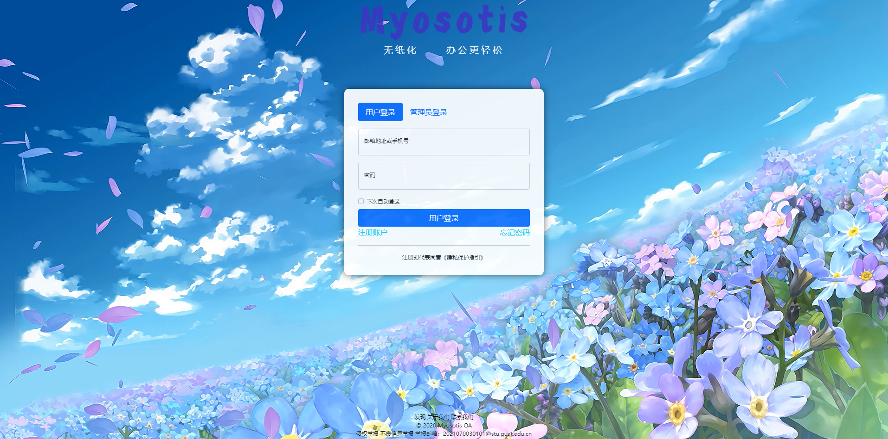

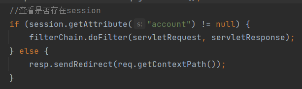

## 2.2页面结构设计

​		页面采用基于弹性盒的三栏式结构，页眉添加logo、标题，导航等；页脚添加页面信息；主体部分：在登录界面采用但盒子居中；在操作页面使用弹性盒两栏结构，左侧栏为导航栏右侧栏为工作空间。

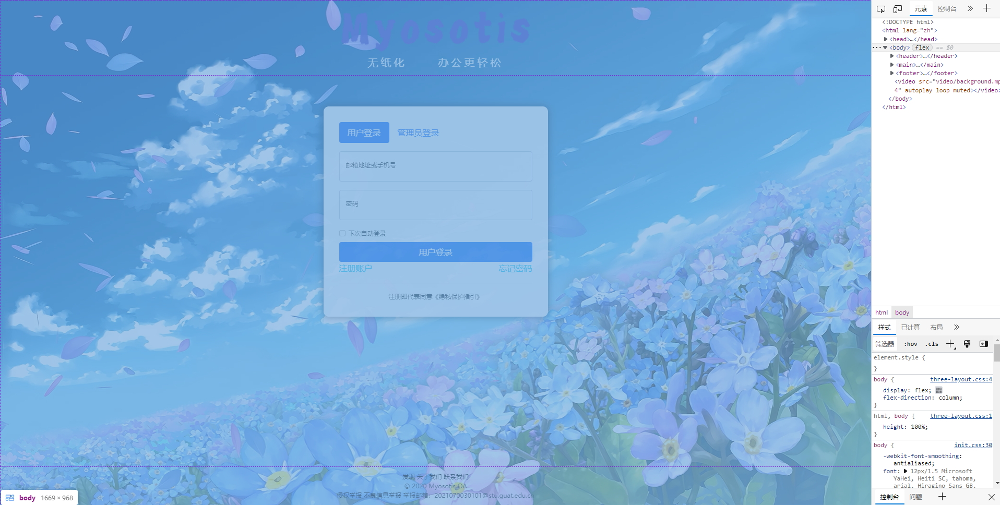

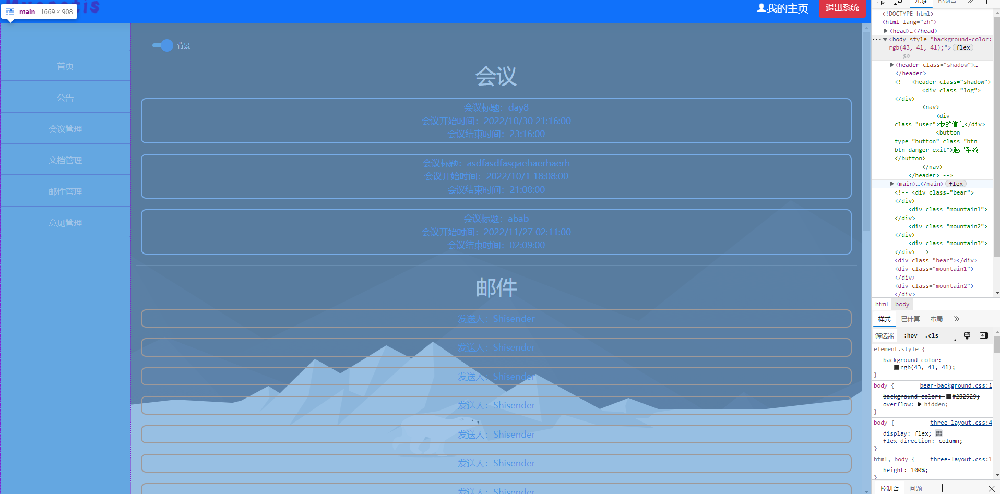

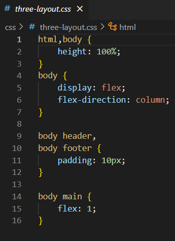

## 2.3页面动画设计

​		为登录页面、用户首页、管理员首页、个人空间首页添加css**关键帧**动画，为页面提高可观赏性。利用svg矢量图标签进行作图，提高页面动画的灵活性。

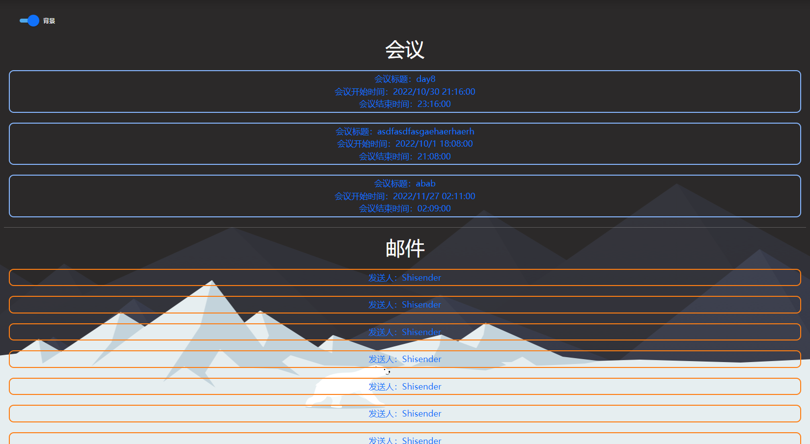

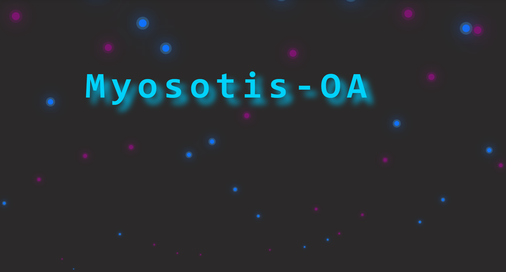

### 文字动画

```css
main .work,
.background {
    position: relative;
    min-width: 1100px;
    background-color: #2B2929;
    z-index: -10;
}

.word {
    position: absolute;
    font-family: "Consolas";
    font-size: 120px;
    letter-spacing: 20px;
    font-weight:bolder;
    color: #00D2FB;
    text-shadow: 20px 20px 20px #00ADD8;

    top: 200px;
    left: calc(50% - 550px);
    z-index: 10;
}

.word::after {
    content: "Myosotis-OA";
    animation: word 20s infinite;
}

.word::before {
    content: "_";
    float: right;
    animation: cursor 0.5s infinite;
}

@keyframes cursor {
    from {
        content: "_";
    }
    to {
        content: "";
    }
}

@keyframes word {
    0% {
        content: "";
    }
    6.36% {
        content: "M";
    }
    12.72% {
        content: "My";
    }
    19.08% {
        content: "Myo";
    }
    25.44% {
        content: "Myos";
    }
    31.8% {
        content: "Myoso";
    }
    38.16% {
        content: "Myosot";
    }
    44.52% {
        content: "Myosoti";
    }
    50.88% {
        content: "Myosotis";
    }
    57.24% {
        content: "Myosotis-";
    }
    63.6% {
        content: "Myosotis-O";
    }
    69.96% {
        content: "Myosotis-OA";
    }
    72.72% {
        content: "Myosotis-O";
    }
    75.44% {
        content: "Myosotis-";
    }
    78.16% {
        content: "Myosotis";
    }
    80.88% {
        content: "Myosoti";
    }
    83.6% {
        content: "Myosot";
    }
    86.32% {
        content: "Myoso";
    }
    89.04% {
        content: "Myos";
    }
    91.76% {
        content: "Myo";
    }
    94.48% {
        content: "My";
    }
    97.2% {
        content: "M";
    }
    100% {
        content: "";
    }
}
```

### 冒泡动画

```css
main .work,
.background {
    position: relative;
    min-width: 1100px;
    background-color: #2B2929;
    padding: 0;
    z-index: -10;
}

.bubbles {
    position: relative;
    z-index: 0;
    height: 100%;
    width: 100%;
    display: flex;
    overflow: hidden;
}

.bubble {
    width: 30px;
    height: 30px;
    border-radius: 50%;
    margin: 0 4px;
    transform: scale(0);
    animation: bubbling calc(1s * var(--tras)) calc(1s * var(--delay)) linear infinite;
}

.bubble:nth-child(odd) {
    background-color: #1071FA;
    box-shadow: 
    0 0 0 10px #4FA8EA44,
    0 0 50px #1071FA,
    0 0 100px #1071FA;
}

.bubble:nth-child(even) {
    background-color: #7B156E;
    box-shadow: 
    0 0 0 10px #7B156E44,
    0 0 50px #7B156E,
    0 0 100px #7B156E;
}

@keyframes bubbling {
    from {
        transform: translateY(100vh) scale(0);
    }
    to {
        transform: translateY(-10vh) scale(1);
    }
}
```

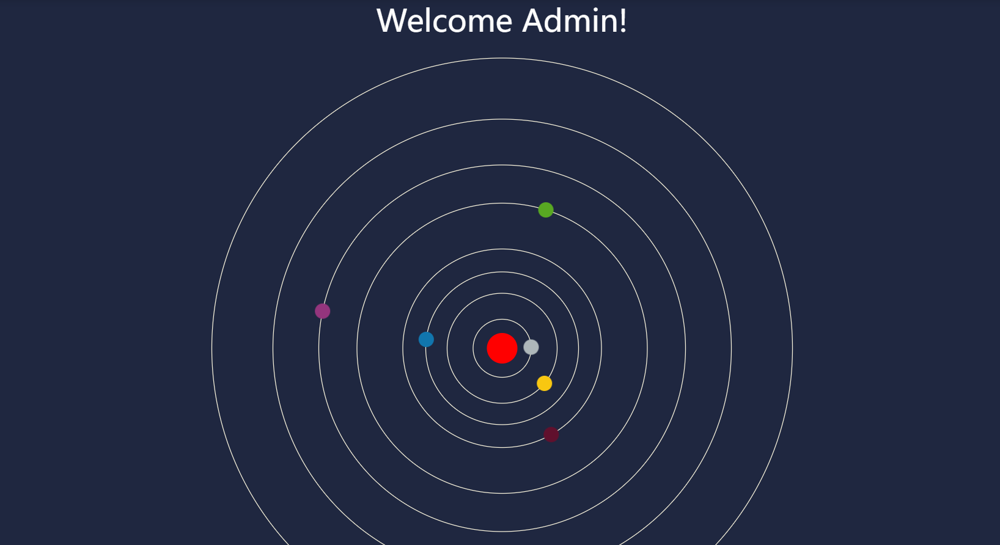

### 环绕动画

```css
main .work {
    background-color: #1f2740;
    color: #ffffff;
}

.Orbit,
.Planet,
#sun {
    cy: 50%;
    cx: 50%;
}

svg {
    width: 100%;
    height: 1000px;
    background-color: #1f2740;
}

#sun {
    r: 20px;
    fill: red;
}

.Orbit{
    stroke: #f8f3dc;
    fill: transparent;
}

#Mercury-Orbit {
    r: 38px;
}

#Venus-Orbit {
    r: 72px;
}

#Earth-Orbit {
    r: 100px;
}

#Mars-Orbit {
    r: 130px;
}

#Jupiter-Orbit {
    r: 190px;
}

#Saturn-Orbit {
    r: 240px;
}

#Uranus-Orbit {
    r: 300px;
}

#Neptune-Orbit {
    r: 380px;
}

.Planet {
    r: 10px;
}

@keyframes rotation {
    from {
        transform: rotate(0deg)
                translate(var(--translate))
                rotate(0deg);
    }
    to {
        transform: rotate(360deg)
                translate(var(--translate)) 
                rotate(-360deg);
    }
}

#Mercury {
    fill: #AEB7BA;
    --translate: 38px;
    animation: rotation 4s linear infinite;
}

#Venus {
    fill: #F8C711;
    --translate: 72px;
    animation: rotation 7.57s linear infinite;
}

#Earth {
    fill: #1176AE;
    --translate: 100px;
    animation: rotation 10.52s linear infinite;
}

#Mars {
    fill: #60102D;
    --translate: 130px;
    animation: rotation 13.68s linear infinite;
}

#Jupiter {
    fill: #58A822;
    --translate: 190px;
    animation: rotation 20s linear infinite;
}

#Saturn {
    fill: #94357D;
    --translate: 240px;
    animation: rotation 30s linear infinite;
}

#Uranus {
    fill: #5C3719;
    --translate: 300px;
    animation: rotation 50s linear infinite;
}

#Neptune {
    fill: #7C1670;
    --translate: 380px;
    animation: rotation 100s linear infinite;
}
```

## 2.4页面功能设计

​		页面提供了完善的办公生态系统，功能提示设计清晰。利用数据库和cookie对用户行为进行实时跟踪提高用户的体验。

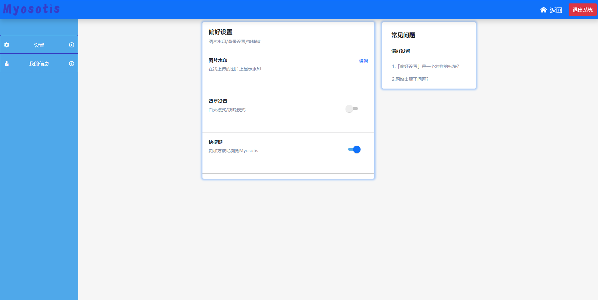

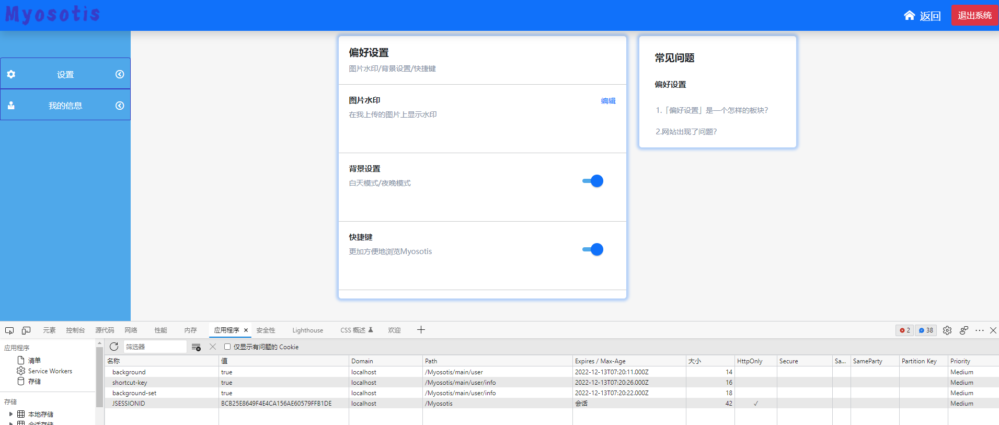

### 采用js+cookie跟踪用户习惯

```js
//检查cookie状态
let check_cookie = () => {
    if($.cookie("background-set") == undefined) {
        $.cookie("background-set",false,{expires: 7,path: "main/admin"});
    }
    if($.cookie("shortcut-key") == undefined) {
        $.cookie("shortcut-key",false,{expires: 7,path: "main/admin"});
    }
    if($.cookie("background-set") == "true") {
        $("#background-set").prop("checked",true);
    } else if($.cookie("background-set") == "false") {
        $("#background-set").prop("checked",false);
    }
    if($.cookie("shortcut-key") == "true") {
        $("#shortcut-key").prop("checked",true);
    } else if($.cookie("shortcut-key") == "false") {
        $("#shortcut-key").prop("checked",false);
    }
}
check_cookie();

//根据开关状态调整设置状态
$("#background-set").change(() => {
    if($("#background-set").prop("checked")) {
        $.cookie("background-set",true,{expires: 7,path: "main/admin"});
    } else {
        $.cookie("background-set",false,{expires: 7,path: "main/admin"});
    }
})

$("#shortcut-key").change(() => {
    if($("#shortcut-key").prop("checked")) {
        $.cookie("shortcut-key",true,{expires: 7,path: "main/admin"});
    } else {
        $.cookie("shortcut-key",false,{expires: 7,path: "main/admin"});
    }
})
```

## 2.5页面美化设计

​		整体上采用简约的结构使用户体验更加舒适清晰；css动画提供关闭开关，可以根据个人喜好启用动画，提高用户个人体验；表单框利用bootstrap框架方便快捷的提供灵动的按钮、输入框设计，再为按钮、输入框添加css设计二次美化加工，添加更多细节。

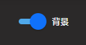

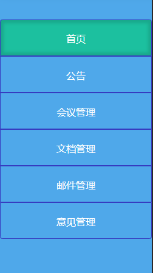

###  开关的美化

```css
.switch {
    margin: 24px;
    display: flex;
}

.switch .slider {
    position: relative;
    height: 8px;
    width: 32px;
    margin-top: 5px;
    border-radius: 8px;
    cursor: pointer;
    background: #c5c5c5;
    transition: all 0.2s ease;
}

.switch .slider:after {
    background: #eeeeee;
    position: absolute;
    left: -8px;
    top: -8px;
    width: 24px;
    height: 24px;
    border-radius: 50%;
    box-shadow: 0px 2px 2px rgba(0, 0, 0, 0.2);
    content: "";
    transition: all 0.2s ease;
}

.switch label {
    margin: 0 8px;
}

.switch .input {
    display: none;
}

.switch .input:checked ~ .slider:after {
    left: 16px;
}

.switch .input:checked ~ .slider {
    background: #4FA8EA;
}

.switch .input:checked ~ .slider:after {
    background: #1071FA;
}
```

## 2.6动态生成重复内容

​		利用js操作节点动态生成重复内容提高代码复用率，以及动态展示数据库中提取的内容。

### 自动生成导航栏

```js
$(`
    <nav>
        <div class="btn-group-vertical">
            <a href="home.html" class="btn btn-outline-success nav-button" id="home">首页</a>
            <a href="announce.html" class="btn btn-outline-success nav-button" id="announce">公告</a>
            <a href="meeting.html" class="btn btn-outline-success nav-button" id="meeting">会议管理</a>
            <a href="document.html" class="btn btn-outline-success nav-button" id="document">文档管理</a>
            <a href="mail.html" class="btn btn-outline-success nav-button" id="mail">邮件管理</a>
            <a href="suggest.html" class="btn btn-outline-success nav-button" id="suggest">意见管理</a>
        </div>
    </nav>
`).prependTo("main");
```

### 动态生成信息

```js
$(`
        <header class="shadow">
            <div class="log"></div>
            <nav>
                <div class="home">返回</div>
                <button type="button" class="btn btn-danger exit">退出系统</button>
            </nav>
        </header>
`).prependTo("body");
```

# 第3章 前端界面详细设计

## 3.1登录界面的提示设计

利用ajax技术从后端获取用户信息。运用js改变标签对css的引用实现对错误提示动画的实现。

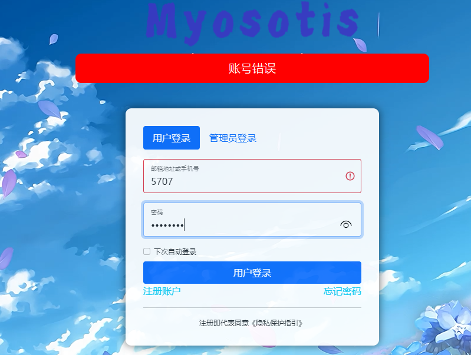

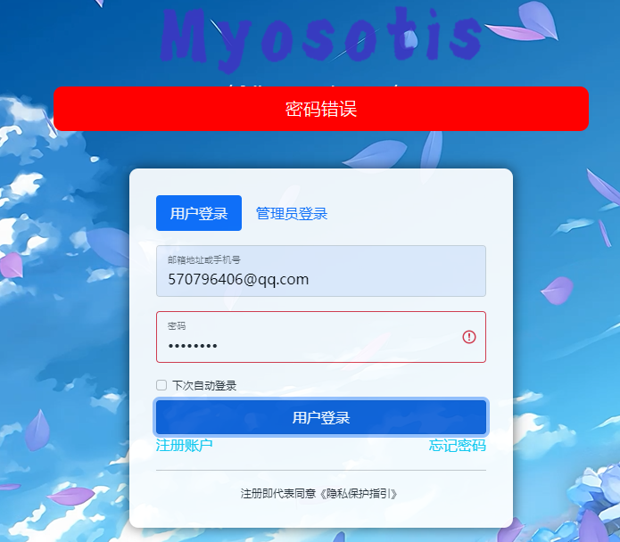

具体实现代码

```js
async function reqest(e) {
    let target = e.data.target;
    let res;
    res = await $.ajax({
        url: `${target}/entry/servlet`,
        type: "POST",
        data: $(".active form").serialize(),
        success: (res) => {
            res = JSON.parse(res);
            if (res.skip) {
                location.href = res.url;
            } else {
                $(`#${target}-${res.error}`).addClass("is-invalid");
                let err;
                if(res.error == "account") {
                    err = $(`<div class="err">账号错误</div>`);
                    $("body").append(err);
                } else {
                    err = $(`<div class="err">密码错误</div>`);
                    $("body").append(err);
                }
                setTimeout(() => {
                    $(err).remove();
                }, 3000);
            }
        }
    })
}

// 消除提示
$("input").focus((e) => {
    $(e.target).removeClass("is-invalid");
});

$("#user-submit").on("click", { target: "user" },reqest);
$("#admin-submit").on("click", { target: "admin" },reqest);
```

## 3.2回车提交数据便利快捷键

利用js获取键盘键入

```js
// 回车提交
$(".tab-content").keyup((e) => {
    if(e.which == 13) {
        let inputs = $(".active input");
        if($(inputs[0]).val() && $(inputs[1]).val()) {
            $(".active button").trigger("click");
        }
    }
})
```

## 3.3二级下拉框的设计

 二级下拉框的实现（同时添加了字体图标）。运用js改变标签对css的引用实现对二级下拉框的设计。

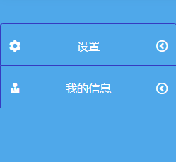

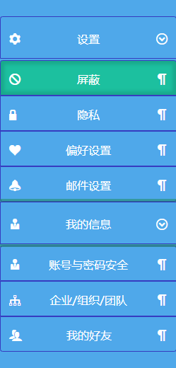

### 二级下拉框的实现（同时添加了字体图标）

运用js改变标签对css的引用

```css
@font-face {
    font-family: 'icomoon';
    src: url('fonts/icomoon.eot?6yv0cz');
    src: url('fonts/icomoon.eot?6yv0cz#iefix') format('embedded-opentype'),
        url('fonts/icomoon.ttf?6yv0cz') format('truetype'),
        url('fonts/icomoon.woff?6yv0cz') format('woff'),
        url('fonts/icomoon.svg?6yv0cz#icomoon') format('svg');
    font-weight: normal;
    font-style: normal;
    font-display: block;
}

@keyframes appear {
    from {
        opacity: 0;
    }
    to {
        opacity: 1;
    }
}

.btn-group-vertical>.btn-group-vertical {
    margin: 0;
    padding: 0px;
}

.btn-group-vertical>.btn-group-vertical>.btn {
    height: 50px;
    line-height: 40px;
}

.none {
    display: none;
}

.appear-action {
    animation: appear 0.5s;
}

.home {
    height: 100%;
    line-height: 40px;
    font-size: 20px;
    margin-right: 20px;
    color: #ffffff;
    cursor: pointer;
}

.home::before {
    font-family: "icomoon";
    content: "\e900";
    margin-right: 10px;
}

nav button::before {
    float: left;
    font-family: "icomoon";
}

nav button::after {
    float: right;
    font-family: "icomoon";
}

.btn-group-vertical .left::after {
    content: "\ea44";
}

.btn-group-vertical .down::after {
    content: "\ea43";
}

#set::before {
    content: "\e994";
}

#info::before {
    content: "\e976";
}

.btn-group-vertical .pilcrow::after {
    content: "\ea73";
}

#shield::before {
    content: "\ea0e";
}

#privacy::before {
    content: "\e98f";
}

#preference::before {
    content: "\e9da";
}

#mail::before {
    content: "\e951";
}

#safe::before {
    content: "\e976";
}

#team::before {
    content: "\e9bc";
}

#friend::before {
    content: "\e972";
}

main .work {
    background-color: #F6F6F6;
}

.work .content {
    width: 900px;
    margin: auto;
    display: flex;
    justify-content: space-around; /*对齐方式*/
}

.content .list,
.content .problem {
    background-color: #ffffff;
    border-radius: 5px;
    box-shadow: 0px 0px 5px 5px #1071fa4c;
}

.content .list {
    width: 550px;
}

.content .problem {
    width:300px;
    height: 100%;
}

.list .h {
    margin: 20px;
}

.list .edit {
    display: flex;
    margin: 20px;
    height: 90px;
}

.edit a {
    width: 30px;
    font-size: 14px;
}

.edit .tip {
    flex: 1;
}

.list h2 {
    font-size: 19px;
    font-weight: 600;
}

.list .subhead {
    color: #8590A6;
    font-size: 14px;
}

.list h3 {
    font-size: 15px;
    font-weight: 600;
}

.problem h3,
.problem h4 {
    font-weight: 600;
    margin: 30px;
}

.problem h3 {
    font-size: 19px;
    
}

.problem h4 {
    font-size: 15px;
}

.problem li {
    cursor: pointer;
    font-weight: 400;
    line-height: 1.5;
    font-size: 14px;
    color: #8590A6;

    margin: 20px 0px;
    margin-right: 20px;
}
```

```js
$.each($("nav > .f > button"),(index,e) => {
    $(e).click(() => {
        if($(e).hasClass("left")) {
            $(e).removeClass("left");
            $(e).addClass("down");
        } else if($(e).hasClass("down")) {
            $(e).removeClass("down");
            $(e).addClass("left");
        }
        if($(e).next().hasClass("none")) {
            $(e).next().removeClass("none");
            $(e).next().addClass("appear-action");
        } else {
            $(e).next().addClass("none");
            $(e).next().removeClass("appear-action");
        }
    });
});
```

## 3.4删除功能的设计

运用ajax技术实现删除标签的同时删除数据库数据，真正实现对数据的实时跟踪。

### ajax跟踪细节

```js
$(".delete").click((e) => {
    if($(e.target).is($("button"))) {
        let confirm = window.confirm("确认删除吗");
        if (confirm) {
            $.ajax({
                url: "../../announce/delete/servlet.do",
                type: "POST",
                data: {
                    id: $(e.target).attr("index")
                },
                success: (res) => {
                    res = JSON.parse(res);
                    if(res) {
                        window.alert("删除成功");
                        $(e.target).parent().remove();
                    } else {
                        window.alert("删除失败");
                    }
                }
            });
        }
    }
});
```

### 标签删除细节

```js
$(e.target).parent().remove();
```

### 动态生成的标签上提供了数据库的id标签

```js
$("#delete").click(() => {
    $.ajax({
        url: "../../announce/get/servlet.do",
        type: "GET",
        success: (res) => {
            res = JSON.parse(res);
            $(".delete").empty();
            res.allAnnounce.forEach(function(e) {
                $(".delete").append($(`
                <div class="option">
                    <p>标题：</p>
                    <p>${e.title}</p>
                    <button type="button" index="${e.id}" class="btn btn-danger">删除</button>
                </div>
                `));
            });
        }
    })
});
```

非原生标签通过attr()函数实现对值的获取，由于数据库索引的存在，利用id主键进行搜索可以提高搜索速度。

## 3.5首页提供对信息的预览与跳转

​		当前存在的消息，重要的提醒事项会通过从数据库的动态跟踪中获取。列出提醒事项，同时实现点击跳转提高工作效率。

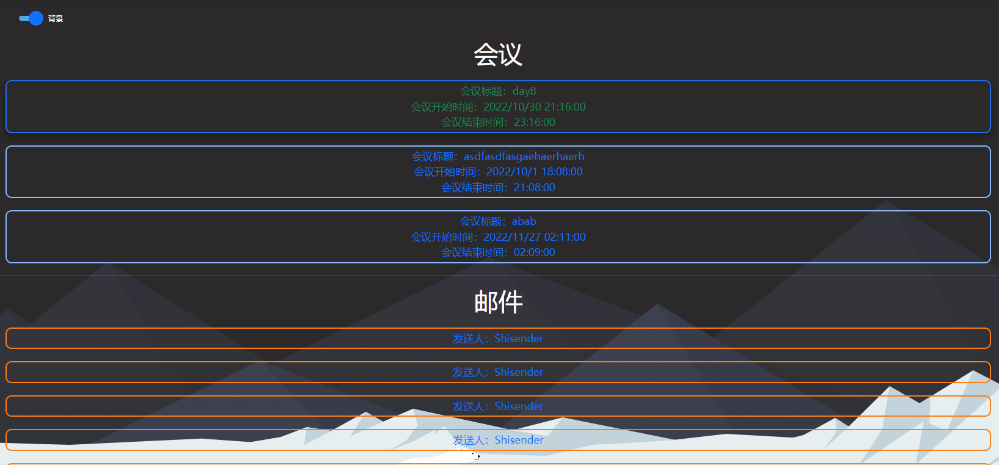

### 动态生成细节

​		运用ajax静态请求技术，获取后端返回的json格式数据转换成链接标签，再利用a标签提供跳转地址

```js
$.ajax({
        url: "../../suggest/get/servlet.do",
        type: "GET",
        dataType: "JSON",
        success: (res) => {
            // console.log(res);
            res.forEach((e) => {
                $(".suggest").append($(`
                    <a href="suggest.html" class="option">
                        <div class="name">发送人：${e.sender}sender</div>
                    </a>
                `));
            })
        }
    })
```

## 3.6下拉搜索框的实现

​		从数据库中动态获取到所有员工的姓名，再用js解释成选项标签。再前端实现搜索相较于后端动态数据库搜索，可以提高搜索效率，减轻数据库压力。

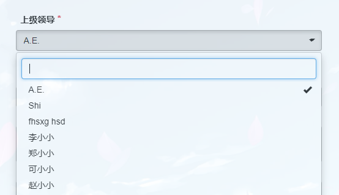

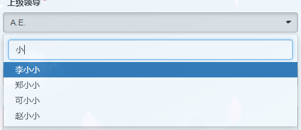

### 动态获取和搜索细节

```js
$.ajax({
    url: "../register/search/servlet",
    type: "GET",
    data: {
        name: "dept"
    },
    dataType: "JSON",
    success: (res) => {
        // console.log(res);
        if (res.skip) {
            location.href = res.url;
        } else {
            res.options.forEach((e) => {
                $('#dept').append($(`<option>${e}</option>`));
            })
            $('#dept').selectpicker('refresh');
        }
    }
});
```

# 总结

​		本系统的优点css代码复用率高，运用了js动态生成，js复用率高，降低了html开发成本。

​		对本系统的编写过程中遇到的问题有：对bootstrap框架运用的不到位，jq的ajax返回值不够清晰，页面分类没有做到提前规划，前后端交互技术不熟练java代码复用率低，用户与密码的结构不清晰导致代码可读性降低。编写时间跨度较长，且处于学习成长期，前后代码结构变化较大可读性较差。

​		还需熟练掌握前后端代码编写，同时规范的代码格式。